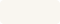
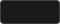
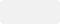
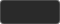
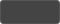
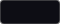
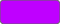
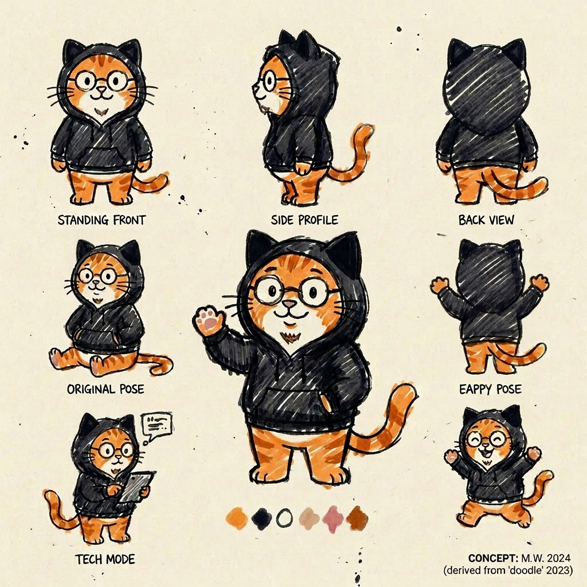

# Art Bible — orange creatives

## デザインエートス

**ラフ、本物、幅広、クール寄り、押しつけない**

ボカロ・ゲーム・アプリ・小説・技術と何でもやってきた orange という人間の記録。
きれいにまとめすぎず、手の跡が残るくらいがちょうどいい。

---

## カラーパレット

### ベース（通常トーン）

| 名前 | スウォッチ | HEX | 用途 |
|------|----------|-----|------|
| オフホワイト |  | `#f9f6f0` | 背景。クリーム寄りの白 |
| インク |  | `#1a1a1a` | 線・テキスト。純黒より柔らかく |

### アクセント（オレンジ）

| 名前 | スウォッチ | HEX | 用途 |
|------|----------|-----|------|
| メインオレンジ |  | `#e8622a` | 主要アクセント。タグ・リンク・強調 |
| ライトオレンジ |  | `#f4a261` | 補助アクセント。ハイライト・塗り |

### ダークモード

ベーストーンの反転版。背景にインク色を使い、テキストを明るくする。
見出しはメインオレンジで目立たせ、リンクはクールなティールで区別する。

| 名前 | スウォッチ | HEX | 用途 |
|------|----------|-----|------|
| ダーク背景 |  | `#1a1a1a` | 背景。ベーストーンのインク色を流用 |
| ダークテキスト |  | `#f1f1f1` | 本文テキスト |
| ダーク見出し |  | `#e8622a` | 見出し。メインオレンジをそのまま使う |
| ダークリンク |  | `#54a5a5` | リンク・アクセント。クールなティールで見出しと区別 |
| ダークミュート |  | `#a0a0a0` | 補助テキスト。日付・メタ情報 |
| ダークコード背景 |  | `#2a2a2a` | コードブロック・引用の背景 |
| ダークボーダー |  | `#444444` | 区切り線・枠線 |

### エッジトーン（uVu 寄り）

コンテンツがゲーム・SF・激しい内容のとき、このパレットに寄せる。

| 名前 | スウォッチ | HEX | 用途 |
|------|----------|-----|------|
| ディープダーク |  | `#0d0d14` | 背景。ほぼ黒の深夜色 |
| ネオンシアン |  | `#00e5ff` | 輝き・ハイライト |
| ネオンパープル |  | `#bf00ff` | アクセント・エネルギー感 |

### NG 色

- **萌え系パステル**: ピンク・ラベンダー・水色の組み合わせ。自己表現として使わない
- **ネオン過多**: エッジトーンはスパイスとして使う。メインに据えない

---

## イラストスタイル

### ベーストーン: 下手うま手描き

- **画風**: 意図的にラフ・ゆがんだ線画。スケッチ感、ペン入れ前の落書きくらいの密度
- **線**: 黒インク、不揃い、手ブレあり。きれいに描こうとしない
- **塗り**: 基本なし。アクセントカラーをざっくり乗せる程度
- **色数**: 3色以内。オフホワイト＋インク＋オレンジ1色が基本
- **テキスト in 画像**: 入れない（タイトルはHTML側で表示）

### エッジトーン: ピクセル・ネオン

uVu（ゲーム作品）テイスト。コンテンツが要求するときだけ使う。

- **画風**: ドット絵、ピクセルアート
- **色**: ディープダーク背景＋ネオンシアン・パープル
- **混在禁止**: ベーストーンとエッジトーンを1枚の画像内で混ぜない

### Do（推奨）
- 手の跡・ペン跡が見える粗さ
- 余白を大きく取る
- 単純なシルエット・記号的な表現
- ゆがみ・不揃いを活かす

### Don't（禁止）
- **萌えキャラ**: かわいい路線の自己表現として不使用（マスコットキャラは別途定義あり）
- **キラキラ・ハート・星の多用**: かわいい路線NG
- **AIっぽいきれいさ**: 整いすぎた線、完璧なグラデーション
- **ネオン過多**: エッジトーン単体では使わない（ベースの文脈があって初めて映える）

---

## マスコットキャラクター

orange の発信代行キャラ。名前未定。

### 基本要素

| 要素 | 内容 |
|------|------|
| 毛色 | オレンジ（茶トラ系） |
| 体型 | 中年猫 |
| 衣装 | 黒フーディ、フードかぶり。フードに猫耳付き（耳の中に色なし、フードと同色） |
| メガネ | 太縁の小さめ丸メガネ |
| ひげ | ちょびあごひげ（デザイナーひげ風） |
| 表情 | 落ち着いて親しみやすい。萌えではないがかわいい（スヌーピー的な方向） |

### 描き方

- ベーストーンの「下手うま手描き」に準拠
- マーカーペン風のラフな線
- 色はオレンジ毛色＋インク（黒フーディ）＋オフホワイト背景の3色基本

### やってはいけないこと

- 萌え化（大きい目、ぷにぷに感、キラキラ）
- 目つきを悪くする（不機嫌≠クール）
- 耳の中にピンクやオレンジを塗る
- リアル寄りの描き込み（洋画風になる）

---

## タイポグラフィ

| 用途 | フォント | ウェイト |
|------|---------|---------|
| 見出し | Hiragino Kaku Gothic ProN / Meiryo | 700 |
| 本文 | Hiragino Kaku Gothic ProN / Meiryo | 400 |

- line-height: 本文 1.8、見出し 1.4
- 英字タイトルはすべて小文字または大文字で統一（混在しない）

---

## レイアウト原則

- **余白を惜しまない**: 詰め込まない
- **カード**: 16:9 サムネイル画像 → タイトル → メタ情報の順
- **角丸**: 10px（カード）、6px（小要素）

---

## カバー画像ルール

- **Featured 記事はカスタムカバー画像必須**（デフォルト画像不可）
- Recent / Archive はデフォルト画像でよい
- カバー画像はこの Art Bible のスタイルに沿って制作する

---

## 技術仕様

- 画像形式: PNG
- 推奨アスペクト比:
  - カードサムネイル: 16:9
  - アイコン・バッジ: 1:1
- 生成ツール: Nano Banana Pro（`C:\dev\MathDesk\scripts\art\cli.ts`）
- 出力先: `C:\dev\MathDesk\art\generated\` → portal リポの該当記事ディレクトリにコピー

### 既存カバー画像

| 記事 | 画像 | トーン |
|------|------|------|
| LLM Part 1 | `articles/llm-mechanism/cover.png` | ベース（チャットバブル手描き） |
| LLM Part 3 | `articles/llm-mechanism-3/cover.png` | ベース（ロボット顔5体手描き） |
